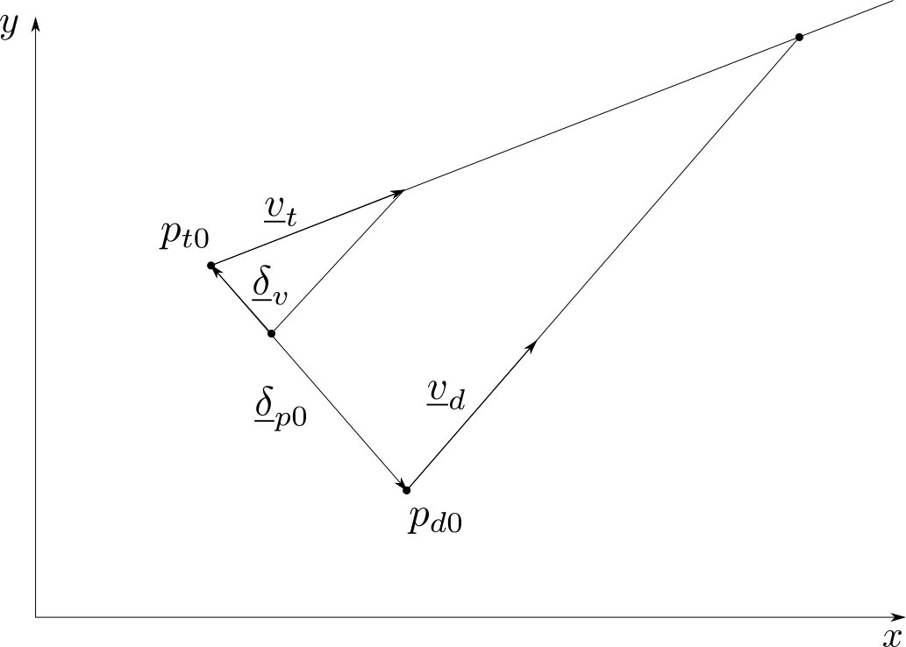

## 1: Derivation

Here we establish the expression of the heading needed by the drone to intercept a single target.

<figure class="cfigure">
  
  <figcaption>Figure 1. -  Notations</figcaption>
</figure>
 

Using the notations presented in figure 1, the position of the drone and the target are given by:
  = \begin{pmatrix}x_{d0}+v_d \cos{\psi_d} t \\ y_{d0}+v_d \sin{\psi_d} t\end{pmatrix} 
$$\begin{equation}
\vect{p}_d= \vect{p}_{d0} + \vect{v}_{d}.t
\label{eq:pos_drone}
\end{equation}
$$


$$
\begin{pmatrix}v_{tx}\\v_{ty}\end{pmatrix}=\begin{pmatrix}v_t \cos{\psi_t}\\v_t \sin{\psi_t}\end{pmatrix}
$$

$$\begin{equation}
\vect{p}_t=\begin{pmatrix}x_{t0}+v_{tx} t \\ y_{t0}+v_{ty} t\end{pmatrix}
\label{eq:pos_target}
\end{equation}
$$


$$\begin{equation}
\vect{p}_t= \vect{p}_{t0} + \vect{v}_{t}.t
\label{eq:pos_target}
\end{equation}
$$

At interception, using \eqref{eq:pos_drone} and \eqref{eq:pos_target}, we have:

$$
\vect{p}_d == \vect{p}_t  \iff \vect{p}_{d0} + \vect{v}_{d}.t = \vect{p}_{t0} + \vect{v}_{t}.t
$$

Rearanging, we get

$$\begin{equation}
t . \vect{\delta_v} = -\vect{\delta_{p0}}
\label{eq:intercept_cond}
\end{equation}
$$

where $$\vect{\delta_v} = \vect{v}_{d}-\vect{v}_{t} $$ and $$\vect{\delta_{p0}} = \vect{p}_{d0}-\vect{p}_{t0}$$ are the differences between drone and target velocities and initial positions.

Condition \eqref{eq:intercept_cond} imposes 

$$\begin{equation}
\vect{\delta_v} \wedge \vect{\delta_{p0}} = 0
\label{eq:intercept_cond1}
\end{equation}
$$

Expressing $$\vect{\delta_v}=\begin{pmatrix}v_d \cos{\psi_d} -v_{tx}\\v_d \sin{\psi_d} -v_{ty}\end{pmatrix}$$ and noting $$\vect{\delta_{p0}} = \begin{pmatrix}\delta_{p0x}\\\delta_{p0y}\end{pmatrix}$$, \eqref{eq:intercept_cond1} can be rewritten as

$$
(v_d \cos{\psi_d} -v_{tx})\delta_{p0y} - (v_d \sin{\psi_d} -v_{ty})\delta_{p0x} = 0
$$

or 


$$
v_d \delta_{p0x} \cos{\psi_d} - v_d \delta_{p0y} \sin{\psi_d} = v_{tx}\delta_{p0y} - v_{ty}\delta_{p0x} 
$$

or


$$\begin{equation}
a  \cos{\psi_d} + b \sin{\psi_d} = c
\label{eq:intercept_cond2}
\end{equation}
$$

with 

$$
\begin{equation}
a=v_d \delta_{p0y} \qquad b=-v_d \delta_{p0x} \qquad c=v_{tx}\delta_{p0y} - v_{ty}\delta_{p0x}
\end{equation}
$$

Substituting variable $$\lambda = \tan{\frac{\psi}{2}}$$ (inverted as $$\psi=2arctan{\lambda} $$), we get

$$
  \cos{\psi} = \frac{1-\lambda^2}{1+\lambda^2} \qquad \sin{\psi} = \frac{2\lambda}{1+\lambda^2}
$$

and \eqref{eq:intercept_cond2} becomes a second order polynomial

$$
(a+c) \lambda^2 -2b \lambda + (c-a) = 0
$$

which can be solved for its roots $$(\lambda_1, \lambda_2)$$, leading to a pair of headings $$(\psi_1, \psi_2)$$

Condition \eqref{eq:intercept_cond} can now be used once again to select the correct heading by enforcing

$$
\begin{equation}
\vect{\delta_v} . \vect{\delta_{p0}} < 0
\label{eq:intercept_cond3}
\end{equation}
$$

for $$t$$ positiveness.

$$t$$, the time of interception is then obtained from \eqref{eq:intercept_cond} as:

$$
t = \frac{|\vect{\delta_{p0}}|}{|\vect{\delta_v}|}
$$

#### Existence of a solution
    
As long as the forward velocity of the drone is strictly greater than the velocity of the target, a solution exists, by construction (TODO: show it, or just think about your chances of escaping when being chased by a faster guy...).

