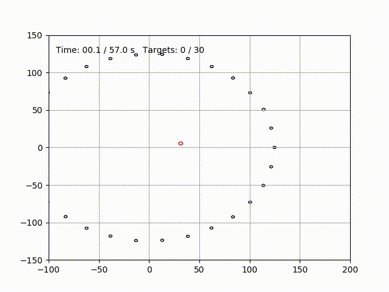

<script src="https://cdn.mathjax.org/mathjax/latest/MathJax.js?config=TeX-AMS-MML_HTMLorMML" type="text/javascript"></script>

<script type="math/tex; mode=display">
    \newcommand{\vect}[1]{\underline{#1}}                         % vector
    \newcommand{\mat}[1]{\mathbf{#1}}                             % matrices
    \newcommand{\est}[1]{\hat{#1}}                                % estimate
    \newcommand{\err}[1]{\tilde{#1}}                              % error
    \newcommand{\esterr}[1]{\tilde{#1}}                           % error
    \newcommand{\pd}[2]{\frac{\partial{#1}}{\partial{#2}}}        % partial derivatives
    \newcommand{\transp}[1]{#1^{T}}                               % transpose
    \newcommand{\inv}[1]{#1^{-1}}                                 % invert
    \newcommand{\norm}[1]{|{#1}|}                                 % norm
    \newcommand{\esp}[1]{\mathbb{E}\left[{#1}\right]}             % expectation
    \newcommand{\identity}[0]{\mathbb{I}}                         % identity
    \newcommand{\jac}[3]{\frac{\partial{#1}}{\partial{#2}}|_{#3}} % Jacobian
</script>

<script type="text/x-mathjax-config">
MathJax.Hub.Config({
  TeX: { equationNumbers: { autoNumber: "AMS" } }
});
</script>


## 1: Introduction

We consider a drone and a set of targets in an euclidian planar environment.
The targets are moving in a uniform rectilinear motion. The drone is moving at a constant forward velocity with a piecewise constant heading.
Our goal is to compute the optimal trajectory for the drone, i.e. the trajectory leading to the fastest interception of all targets as depicted on figure 0.

<figure class="cfigure">
  
  
  <figcaption>Fig0. -  Drone target interception thingy principle. Let's play sheepdog</figcaption>
</figure>
<br>

## 2: Single target

### 2.1: Derivation
Here we establish the expression of the heading needed by the drone to intercept a single target.


The position of the drone and the target are given by:
  = \begin{pmatrix}x_{d0}+v_d \cos{\psi_d} t \\ y_{d0}+v_d \sin{\psi_d} t\end{pmatrix} 
$$\begin{equation}
\vect{p}_d= \vect{p}_{d0} + \vect{v}_{d}.t
\label{eq:pos_drone}
\end{equation}
$$


$$
\begin{pmatrix}v_{tx}\\v_{ty}\end{pmatrix}=\begin{pmatrix}v_t \cos{\psi_t}\\v_t \sin{\psi_t}\end{pmatrix}
$$

$$\begin{equation}
\vect{p}_t=\begin{pmatrix}x_{t0}+v_{tx} t \\ y_{t0}+v_{ty} t\end{pmatrix}
\label{eq:pos_target}
\end{equation}
$$


$$\begin{equation}
\vect{p}_t= \vect{p}_{t0} + \vect{v}_{t}.t
\label{eq:pos_target}
\end{equation}
$$

At interception, using \eqref{eq:pos_drone} and \eqref{eq:pos_target}, we have:

$$
\vect{p}_d == \vect{p}_t  \iff \vect{p}_{d0} + \vect{v}_{d}.t = \vect{p}_{t0} + \vect{v}_{t}.t
$$

Rearanging, we get

$$\begin{equation}
t . \vect{\delta_v} = -\vect{\delta_{p0}}
\label{eq:intercept_cond}
\end{equation}
$$

where $$\vect{\delta_v} = \vect{v}_{d}-\vect{v}_{t} $$ and $$\vect{\delta_{p0}} = \vect{p}_{d0}-\vect{p}_{t0}$$ are the differences between drone and target velocities and initial positions.

Condition \eqref{eq:intercept_cond} imposes 

$$\begin{equation}
\vect{\delta_v} \wedge \vect{\delta_{p0}} = 0
\label{eq:intercept_cond1}
\end{equation}
$$


Expressing $$\vect{\delta_v}=\begin{pmatrix}v_d \cos{\psi_d} -v_{tx}\\v_d \sin{\psi_d} -v_{ty}\end{pmatrix}$$ and noting $$\vect{\delta_{p0}} = \begin{pmatrix}\delta_{p0x}\\\delta_{p0y}\end{pmatrix}$$, \eqref{eq:intercept_cond1} can be rewritten as

$$
(v_d \cos{\psi_d} -v_{tx})\delta_{p0y} - (v_d \sin{\psi_d} -v_{ty})\delta_{p0x} = 0
$$

or 


$$
v_d \delta_{p0x} \cos{\psi_d} - v_d \delta_{p0y} \sin{\psi_d} = v_{tx}\delta_{p0y} - v_{ty}\delta_{p0x} 
$$

or


$$\begin{equation}
a  \cos{\psi_d} + b \sin{\psi_d} = c
\label{eq:intercept_cond2}
\end{equation}
$$

with 

$$
\begin{equation}
a=v_d \delta_{p0y} \qquad b=-v_d \delta_{p0x} \qquad c=v_{tx}\delta_{p0y} - v_{ty}\delta_{p0x}
\end{equation}
$$


Substituting variable $$\lambda = \tan{\frac{\psi}{2}}$$ ($$\psi=2arctan{\lambda} $$), we get

$$
  \cos{\psi} = \frac{1-\lambda^2}{1+\lambda^2} \qquad \sin{\psi} = \frac{2\lambda}{1+\lambda^2}
$$

and \eqref{eq:intercept_cond2} becomes a second order polynomial

$$
(a+c) \lambda^2 -2b \lambda + (c-a) = 0
$$

which can be solved for its roots $$(\lambda_1, \lambda_2)$$, leading to a pair of headings $$(\psi_1, \psi_2)$$

Condition \eqref{eq:intercept_cond} can now be used once again to select the correct heading by enforcing

$$
\begin{equation}
\vect{\delta_v} . \vect{\delta_{p0}} < 0
\label{eq:intercept_cond3}
\end{equation}
$$

for $$t$$ positiveness.

$$t$$, the time of interception is then obtained from \eqref{eq:intercept_cond} as:

$$
t = \frac{|\vect{\delta_{p0}}|}{|\vect{\delta_v}|}
$$

#### Existence of a solution
    
As long as the forward velocity of the drone is strictly greater than the velocity of the target, a solution exists, by construction (TODO: show it, or just think about your chances of escaping when being chased by a faster guy...).

### 2.2: implementation

The above computation is implemented as follow 
<script src="https://emgithub.com/embed.js?target=https%3A%2F%2Fgithub.com%2Fpoine%2Fproj_emen%2Fblob%2Ff65de3c1e3cd0c73b890d312f9791412f1fad86a%2Fsrc%2Fproj_manen.py%23L51-L63&style=github&showBorder=on&showLineNumbers=on"></script>

[code](https://github.com/poine/proj_emen/blob/main/src/proj_manen.py)


This [first test](https://github.com/poine/proj_emen/blob/main/src/test_1.py) runs our computation on a set of harcoded examples and displays the results as shown on figure 1. It additionally measures that my circa 2014 laptop is able to run this function at 10kHz.

<figure class="cfigure">
  
  <figcaption>Fig1. -  Interception examples.</figcaption>
</figure>
<br>


## 3: Multiple targets


### 3.1: Implementation

When considering our initial problem, a set of targets, all that is left to do is to decide the sequence in which the interceptions will proceed.
With this information in hand, we apply our previous computation iteratively to the sequence of targets as follows:

<script src="https://emgithub.com/embed.js?target=https%3A%2F%2Fgithub.com%2Fpoine%2Fproj_emen%2Fblob%2Ff65de3c1e3cd0c73b890d312f9791412f1fad86a%2Fsrc%2Fproj_manen.py%23L51-L69&style=github&showBorder=on&showLineNumbers=on"></script>


We start feeling the need of a way to store and describe scenarios, which we quench in the following way:
<details markdown="1">
  <summary>Click for details</summary>
  
<script src="https://emgithub.com/embed.js?target=https%3A%2F%2Fgithub.com%2Fpoine%2Fproj_emen%2Fblob%2Ff9548a51450f6b4e163f28c710f764240a8b81ec%2Fsrc%2Fproj_manen.py%23L71-L81&style=github&showLineNumbers=on"></script>

[scenario_2.yaml](https://github.com/poine/proj_emen/blob/main/src/scenario_2.yaml)

<script src="https://emgithub.com/embed.js?target=https%3A%2F%2Fgithub.com%2Fpoine%2Fproj_emen%2Fblob%2Fmain%2Fsrc%2Fscenario_2.yaml&style=github&showLineNumbers=on"></script>

</details>
<!-- --------------------------------------------------------------------------------------------------- -->
<br>


We create a [6  targets scenari](https://github.com/poine/proj_emen/blob/main/src/scenario_6.yaml) with increasing headings and intercept them in order. This leads to the spiral like trajectory depicted on figure 2

<figure class="cfigure">
  
  <figcaption>Fig2. -  Interception examples with 6 targets.</figcaption>
</figure>
<br>

### 3.2: Exhaustive search

For scenario with small number of targets, sequences of targets can be exhaustively searched for the optimal.

<script src="https://emgithub.com/embed.js?target=https%3A%2F%2Fgithub.com%2Fpoine%2Fproj_emen%2Fblob%2F424323787aac42daf5e625b45554e1dcdaf81729%2Fsrc%2Fproj_manen.py%23L83-L94&style=github&showBorder=on&showLineNumbers=on"></script>


We create a [scenari with two targets](https://github.com/poine/proj_emen/blob/main/src/scenario_2.yaml) and test the two possible sequences as depicted on figure 3, one leading to a total time of $$3.08 s$$ and the other $$4.86 s$$
<figure class="cfigure">
  
  <figcaption>Fig3. -  Interception examples with 2 targets.</figcaption>
</figure>
<br>

We create a [scenari with three targets](https://github.com/poine/proj_emen/blob/main/src/scenario_3.yaml) and test the six possible sequences as depicted on figure 4. Total times vary between $$8.25s$$ and $$25.08s$$
<figure class="cfigure">
  
  <figcaption>Fig4. -  All sequences on a 3 targets example.</figcaption>
</figure>
<br>


On random scenario with increasing number of targets, we measure the time for an exhaustive search:


<figure class="cfigure">
  
  <figcaption>Fig5. -  Exhaustive search time versus number of targets.</figcaption>
</figure>
<br>

It becomes increasingly clear that we will not be able to brute-force our way into this problem and that an exhaustive search becomes intractable for number of targets above 8.

### 3.3: Naïve heuristic


We create a naïve heuristic by selecting the target that is closest to the drone at each decision time.

<script src="https://emgithub.com/embed.js?target=https%3A%2F%2Fgithub.com%2Fpoine%2Fproj_emen%2Fblob%2F424323787aac42daf5e625b45554e1dcdaf81729%2Fsrc%2Ftest_3.py%23L11-L20&style=github&showBorder=on&showLineNumbers=on"></script>


We test our heuristic on a 30 targets scenario (for which we are curently unable to compute the optimal)
<figure class="cfigure">
  
  <figcaption>Fig6. -  Heuristics on 30 targets.</figcaption>
</figure>
<br>

As it seems to perform moderatly well on the large 30 targets example we throw at it, we seek to gain a quantitative evalution of its performances. We define a set of 7 targets scenarios and perform an exhaustive search on each of them. Results are summarized in fig 7

<figure class="cfigure">
  
  <figcaption>Fig7. -  histograms of 7 targets scenarios.</figcaption>
</figure>
<br>

We use our heuristic to improve the exhaustive search by throwing away solutions that are worse than our heuristic. (The improvement is less dramatic than I had hoped for, might be due to the implementation using python exceptions...)

<figure class="cfigure">
  
  <figcaption>Fig8. -  Improved exhaustive search.</figcaption>
</figure>
<br>


### 3.4: Local refinement


In order to try and improve the solution given by out heuristic, we implement a local search :

<script src="https://emgithub.com/embed.js?target=https%3A%2F%2Fgithub.com%2Fpoine%2Fproj_emen%2Fblob%2F37b1d274f75cafd08f92b6953a7f97f00934746b%2Fsrc%2Ftest_4.py%23L13-L25&style=github&showBorder=on&showLineNumbers=on"></script>

We apply the local search to a 7 targets scenario, in which the optimal is dicovered.
<details markdown="1">
  <summary>Click for details</summary>

```
loading scenario from file: scenario_7_2.yaml
heuristic closest target
 23.36 ['1', '2', '3', '4', '5', '6', '7']
local search
 23.19 ['1', '2', '4', '5', '6', '3', '7']
 21.66 ['7', '1', '2', '4', '5', '6', '3']
 20.93 ['7', '1', '2', '4', '5', '3', '6']
 20.84 ['7', '1', '2', '5', '4', '3', '6']
 20.12 ['6', '7', '1', '2', '5', '4', '3']
 19.10 ['6', '7', '1', '2', '5', '3', '4']
 18.78 ['6', '7', '1', '2', '4', '5', '3']
 18.75 ['6', '7', '1', '2', '3', '4', '5']
 18.51 ['6', '7', '1', '2', '4', '3', '5']
optimal
 18.51 ['6', '7', '1', '2', '4', '3', '5']
```
</details><br>
<!-- --------------------------------------------------------------------------------------------------- -->

We apply the local search to a 10 targets scenario. We improve the heuristic solution but fail to discover the optimal. Flight time is reduced from 78.55s to 50.11s
<details markdown="1">
  <summary>Click for details</summary>

```
loading scenario from file: scenario_10_1.yaml
heuristic closest target
 78.55 ['10', '2', '7', '9', '1', '4', '5', '6', '3', '8']
local search
 74.42 ['10', '7', '9', '1', '4', '5', '6', '3', '8', '2']
 70.35 ['10', '7', '9', '4', '1', '5', '6', '3', '8', '2']
 66.97 ['10', '7', '9', '4', '1', '5', '3', '6', '8', '2']
 63.44 ['2', '10', '7', '9', '4', '1', '5', '3', '6', '8']
 58.58 ['2', '10', '9', '4', '1', '7', '5', '3', '6', '8']
optimal
 50.11 ['2', '10', '9', '5', '8', '6', '3', '7', '1', '4']
```
</details><br>
<!-- --------------------------------------------------------------------------------------------------- -->


We apply the local search to a 30 targets scenario (unknown optimal). Flight time is reduced from 169.86s to 97.06s

<details markdown="1">
  <summary>Click for details</summary>

```
loading scenario from file: scenario_30_1.yaml
heuristic closest target
169.86 ['2', '3', '4', '5', '29', '7', '6', '9', '11', '13', '8', '16', '10', '22', '12', '21', '1', '27', '26', '28', '24', '20', '19', '18', '17', '15', '14', '23', '25', '30']
local search
168.21 ['2', '3', '4', '5', '29', '7', '6', '9', '11', '13', '8', '16', '22', '12', '21', '1', '27', '10', '26', '28', '24', '20', '19', '18', '17', '15', '14', '23', '25', '30']
163.72 ['2', '3', '4', '5', '29', '7', '6', '9', '11', '13', '8', '16', '22', '12', '1', '27', '10', '26', '28', '24', '20', '19', '18', '17', '15', '14', '23', '25', '30', '21']
163.09 ['2', '3', '4', '5', '29', '7', '6', '9', '11', '13', '8', '22', '12', '1', '27', '10', '26', '28', '24', '20', '19', '18', '17', '15', '14', '16', '23', '25', '30', '21']
160.90 ['3', '4', '5', '29', '7', '6', '9', '11', '13', '8', '22', '12', '1', '27', '10', '26', '28', '24', '20', '2', '19', '18', '17', '15', '14', '16', '23', '25', '30', '21']
159.35 ['3', '4', '5', '29', '7', '6', '9', '11', '13', '8', '22', '12', '1', '27', '10', '26', '28', '24', '20', '19', '2', '18', '17', '15', '14', '16', '23', '25', '30', '21']
141.62 ['3', '4', '5', '29', '7', '6', '9', '11', '13', '8', '22', '12', '1', '27', '10', '28', '24', '20', '19', '2', '18', '17', '15', '14', '16', '23', '25', '30', '21', '26']
137.54 ['3', '4', '5', '29', '7', '11', '6', '9', '13', '8', '22', '12', '1', '27', '10', '28', '24', '20', '19', '2', '18', '17', '15', '14', '16', '23', '25', '30', '21', '26']
131.35 ['3', '4', '5', '29', '7', '11', '6', '9', '13', '8', '22', '27', '12', '1', '10', '28', '24', '20', '19', '2', '18', '17', '15', '14', '16', '23', '25', '30', '21', '26']
130.22 ['3', '4', '5', '29', '7', '11', '6', '9', '8', '13', '22', '27', '12', '1', '10', '28', '24', '20', '19', '2', '18', '17', '15', '14', '16', '23', '25', '30', '21', '26']
129.93 ['3', '4', '5', '29', '7', '11', '6', '9', '8', '13', '22', '27', '12', '1', '10', '28', '24', '20', '19', '2', '18', '17', '14', '15', '16', '23', '25', '30', '21', '26']
129.73 ['3', '4', '5', '29', '7', '11', '6', '9', '8', '13', '22', '27', '12', '1', '10', '28', '24', '20', '19', '2', '18', '17', '14', '15', '16', '23', '25', '21', '26', '30']
127.89 ['30', '3', '4', '5', '29', '7', '11', '6', '9', '8', '13', '22', '27', '12', '1', '10', '28', '24', '20', '19', '2', '18', '17', '14', '15', '16', '23', '25', '21', '26']
119.82 ['30', '3', '4', '5', '29', '7', '11', '9', '8', '6', '13', '22', '27', '12', '1', '10', '28', '24', '20', '19', '2', '18', '17', '14', '15', '16', '23', '25', '21', '26']
118.13 ['30', '3', '4', '5', '29', '7', '11', '9', '6', '13', '8', '22', '27', '12', '1', '10', '28', '24', '20', '19', '2', '18', '17', '14', '15', '16', '23', '25', '21', '26']
118.11 ['30', '3', '4', '5', '7', '29', '11', '9', '6', '13', '8', '22', '27', '12', '1', '10', '28', '24', '20', '19', '2', '18', '17', '14', '15', '16', '23', '25', '21', '26']
116.94 ['30', '3', '4', '5', '7', '29', '11', '9', '6', '13', '8', '16', '22', '27', '12', '1', '10', '28', '24', '20', '19', '2', '18', '17', '14', '15', '23', '25', '21', '26']
114.82 ['30', '3', '4', '5', '7', '29', '11', '9', '6', '13', '8', '16', '22', '27', '12', '1', '10', '28', '20', '19', '2', '18', '17', '14', '15', '23', '25', '24', '21', '26']
114.75 ['30', '4', '5', '7', '29', '11', '9', '6', '13', '8', '16', '22', '27', '12', '1', '10', '28', '3', '20', '19', '2', '18', '17', '14', '15', '23', '25', '24', '21', '26']
107.58 ['30', '4', '5', '7', '29', '11', '9', '6', '13', '8', '16', '22', '27', '12', '1', '10', '28', '3', '20', '19', '2', '18', '14', '15', '17', '23', '25', '24', '21', '26']
107.42 ['30', '4', '5', '7', '29', '11', '9', '6', '8', '13', '16', '22', '27', '12', '1', '10', '28', '3', '20', '19', '2', '18', '14', '15', '17', '23', '25', '24', '21', '26']
105.82 ['30', '4', '5', '7', '29', '11', '9', '6', '8', '16', '22', '27', '12', '1', '10', '28', '3', '20', '19', '2', '18', '14', '15', '13', '17', '23', '25', '24', '21', '26']
105.53 ['1', '30', '4', '5', '7', '29', '11', '9', '6', '8', '16', '22', '27', '12', '10', '28', '3', '20', '19', '2', '18', '14', '15', '13', '17', '23', '25', '24', '21', '26']
105.27 ['1', '30', '4', '5', '7', '29', '11', '9', '6', '8', '22', '27', '12', '10', '28', '3', '20', '19', '2', '18', '14', '15', '13', '17', '16', '23', '25', '24', '21', '26']
105.06 ['1', '30', '4', '5', '7', '29', '11', '9', '6', '8', '22', '27', '12', '10', '28', '3', '20', '19', '2', '18', '15', '14', '13', '17', '16', '23', '25', '24', '21', '26']
103.11 ['1', '30', '4', '5', '7', '29', '11', '9', '6', '8', '22', '12', '27', '10', '28', '3', '20', '19', '2', '18', '15', '14', '13', '17', '16', '23', '25', '24', '21', '26']
 97.80 ['1', '30', '4', '5', '7', '29', '11', '9', '6', '8', '10', '22', '12', '27', '28', '3', '20', '19', '2', '18', '15', '14', '13', '17', '16', '23', '25', '24', '21', '26']
 97.15 ['1', '30', '3', '4', '5', '7', '29', '11', '9', '6', '8', '10', '22', '12', '27', '28', '20', '19', '2', '18', '15', '14', '13', '17', '16', '23', '25', '24', '21', '26']
 97.06 ['1', '30', '3', '4', '5', '7', '29', '11', '9', '6', '8', '10', '22', '12', '27', '28', '20', '19', '18', '2', '15', '14', '13', '17', '16', '23', '25', '24', '21', '26']
 ```
</details><br>
<!-- --------------------------------------------------------------------------------------------------- -->

